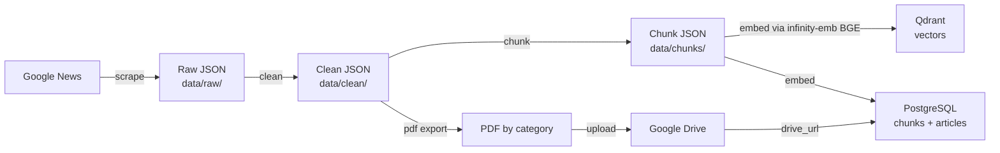
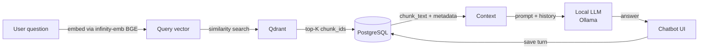

# Architecture

The system is split into two independent pipelines: a batch pipeline that
builds the knowledge base, and an online pipeline that answers questions
against it.

## Batch pipeline (offline)

Run with `python run_pipeline.py`, or step by step with `--step scrape|clean|chunk|embed|pdf`.
Every step is idempotent: re-running the pipeline skips articles/chunks that
are already stored.

## Online pipeline (per query)

Implemented by `rag/pipeline.py`, which wires together `rag/retriever.py`
(search) and `rag/generator.py` (answer generation), and persists both the
question and answer to `chat_messages`. Both embedding (`pipeline/embedder.py`,
`rag/retriever.py`) and generation (`rag/generator.py`) talk to local,
OpenAI-API-compatible servers — infinity-emb and Ollama — via the standard
`openai` Python SDK pointed at a custom `base_url`, so no data leaves the
local stack and no OpenAI API key is required by default.

## Why PostgreSQL + Qdrant together

Qdrant is optimized for approximate nearest-neighbor vector search but is not
a great fit for storing and querying large text blobs or relational data.
PostgreSQL is the opposite: excellent for structured, relational storage but
not built for vector similarity search.

So the system splits responsibilities:

- **Qdrant** stores only the embedding vector plus light metadata
  (`chunk_id`, `article_id`, `title`, `source`, `date`, `category`) needed to
  filter/display search results. It does **not** store `chunk_text`.
- **PostgreSQL** stores the full `chunk_text`, article metadata, and all chat
  history.

The two stores are linked by `chunk_id`: a Qdrant search returns the
`chunk_id`s of the closest vectors, and those ids are used to fetch the
actual text from PostgreSQL's `chunks` table. This keeps each store doing
what it's good at, and keeps Qdrant's index small and fast.

## Cloud stack vs. local stack

The pipeline and RAG code (`pipeline/embedder.py`, `rag/retriever.py`,
`rag/generator.py`) point at OpenAI-API-compatible `base_url`s, so the same
code path serves either a cloud-hosted or a fully local deployment — only
`config.py` / `.env` change.

| Component  | Cloud Stack            | Local Stack (default, via Docker) |
|------------|-------------------------|------------------------------------|
| Embedding  | OpenAI `text-embedding-3-small` (1536-dim) | BGE-large-en-v1.5 via infinity-emb (1024-dim) |
| Generation | GPT-4o-mini             | Llama 3.1 via Ollama               |
| Vector DB  | Qdrant                  | Qdrant (same)                      |
| Relational | PostgreSQL              | PostgreSQL (same)                  |
| UI         | Streamlit               | React + TypeScript                 |
| Deployment | Manual                  | Docker Compose                     |

See [Setup → Running with Local Stack](setup.md#running-with-local-stack-docker)
for how to bring up the local stack, and the warning there about
`EMBED_DIM` when switching between the two.
