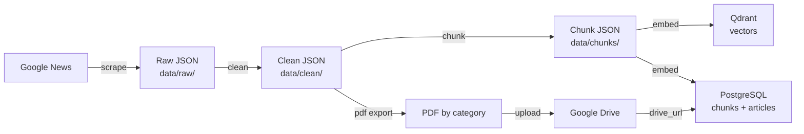

# Architecture

The system is split into two independent pipelines: a batch pipeline that
builds the knowledge base, and an online pipeline that answers questions
against it.

## Batch pipeline (offline)

Run with `python run_pipeline.py`, or step by step with `--step scrape|clean|chunk|embed|pdf`.
Every step is idempotent: re-running the pipeline skips articles/chunks that
are already stored.

## Online pipeline (per query)

Implemented by `rag/pipeline.py`, which wires together `rag/retriever.py`
(search) and `rag/generator.py` (answer generation), and persists both the
question and answer to `chat_messages`.

## Why PostgreSQL + Qdrant together

Qdrant is optimized for approximate nearest-neighbor vector search but is not
a great fit for storing and querying large text blobs or relational data.
PostgreSQL is the opposite: excellent for structured, relational storage but
not built for vector similarity search.

So the system splits responsibilities:

- **Qdrant** stores only the embedding vector plus light metadata
  (`chunk_id`, `article_id`, `title`, `source`, `date`, `category`) needed to
  filter/display search results. It does **not** store `chunk_text`.
- **PostgreSQL** stores the full `chunk_text`, article metadata, and all chat
  history.

The two stores are linked by `chunk_id`: a Qdrant search returns the
`chunk_id`s of the closest vectors, and those ids are used to fetch the
actual text from PostgreSQL's `chunks` table. This keeps each store doing
what it's good at, and keeps Qdrant's index small and fast.
