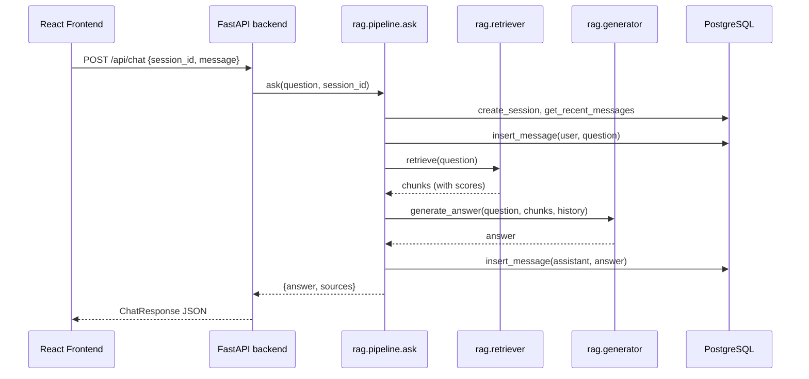

# RAG Pipeline (Orchestrator)

`rag/pipeline.py`

## Full request lifecycle: user question → answer

`ask(question, session_id)` is the single entry point every UI calls — the
FastAPI backend's `POST /api/chat` endpoint (`backend/main.py`), used by the
[React frontend](../frontend.md), and the Streamlit prototype
(`chatbot/app.py`). It ties together session management, retrieval,
generation, and persistence:

1. **Ensure the session exists.** `db.postgres.create_session(session_id)` —
   a no-op insert (`ON CONFLICT DO NOTHING`) if the session already exists.
2. **Load conversation history.** The last `CONVERSATION_HISTORY_LIMIT`
   (default 10) messages for this session are fetched from
   `chat_messages`, oldest first.
3. **Persist the user's message** to `chat_messages` immediately, before
   generation, so it's saved even if generation later fails.
4. **Retrieve context.** `rag.retriever.retrieve(question)` embeds the
   question and returns the top-K most relevant chunks. See
   [Retriever](retriever.md).
5. **Generate the answer.** `rag.generator.generate_answer(question, chunks,
   history)` builds the prompt and calls the LLM (`RAG_GENERATOR_MODEL` via OpenRouter). See
   [Generator](generator.md).
6. **Persist the assistant's answer** to `chat_messages`.
7. **Return** `{"answer": str, "sources": list[dict]}` to the caller. The
   FastAPI backend reshapes this into its `ChatResponse` schema and returns
   it as JSON; the React UI renders `answer` as the chat bubble and
   `sources` as expandable `SourceCard`s underneath it.

## Session management

The React frontend generates a `session_id` client-side via
`POST /api/session` on first load and caches it in `localStorage` (see
[Frontend](../frontend.md#session-persistence-localstorage-fastapi-postgresql)),
so it persists across page reloads in the same browser but a new browser or
cleared storage starts a fresh conversation. The Streamlit prototype instead
generates its `session_id` directly in `st.session_state`. Either way, the
`session_id` is passed to every call to `ask()`, and is the sole key used to
scope conversation history — there is no user authentication layer in this
project.
