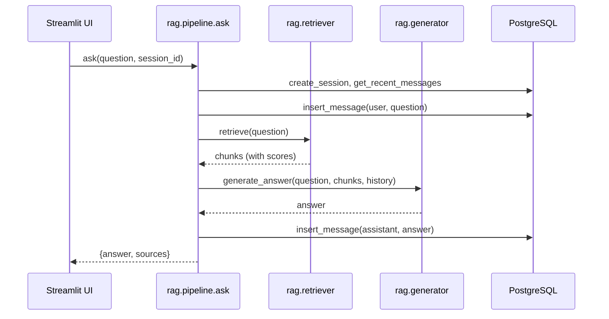

# RAG Pipeline (Orchestrator)

`rag/pipeline.py`

## Full request lifecycle: user question → answer

`ask(question, session_id)` is the single entry point the chatbot UI calls.
It ties together session management, retrieval, generation, and persistence:

1. **Ensure the session exists.** `db.postgres.create_session(session_id)` —
   a no-op insert (`ON CONFLICT DO NOTHING`) if the session already exists.
2. **Load conversation history.** The last `CONVERSATION_HISTORY_LIMIT`
   (default 10) messages for this session are fetched from
   `chat_messages`, oldest first.
3. **Persist the user's message** to `chat_messages` immediately, before
   generation, so it's saved even if generation later fails.
4. **Retrieve context.** `rag.retriever.retrieve(question)` embeds the
   question and returns the top-K most relevant chunks. See
   [Retriever](retriever.md).
5. **Generate the answer.** `rag.generator.generate_answer(question, chunks,
   history)` builds the prompt and calls GPT-4o-mini. See
   [Generator](generator.md).
6. **Persist the assistant's answer** to `chat_messages`.
7. **Return** `{"answer": str, "sources": list[dict]}` to the caller — the
   Streamlit UI renders `answer` as the chat bubble and `sources` as an
   expandable list of source articles underneath it.

## Session management

Each Streamlit browser session generates one `session_id` (a UUID) on first
load and stores it in `st.session_state`, so it persists across reruns
within that browser tab but a new tab/session starts a fresh conversation.
The `session_id` is passed to every call to `ask()`, and is the sole key
used to scope conversation history — there is no user authentication layer
in this project.
